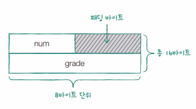
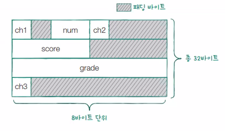

### 구조체 변수의 크기
- 바이트 얼라인먼트 : 구조체 멤버의 크기가 정렬하기위해 패딩 바이트를 넣음
    
- 구조체의 단점이 바로 이것 => 용량을 크게 잡음
- 이렇게 될수도 있음
    
- pragma pack(1) 를 사용하면 패딩바이트를 사용하지 않게 할 수 있음

- 구조체안의 포인터 변수
    > 동적할당을 하거나

    > 다른변수의 주소를 담기

    > 끝날때는 꼭 free로 해제해주기

- 구조체 내 구조체 사용
